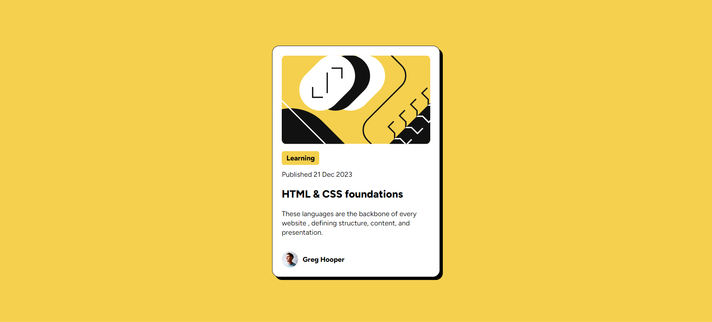

# Frontend Mentor - Blog preview card solution

This is a solution to the [Blog preview card challenge on Frontend Mentor](https://www.frontendmentor.io/challenges/blog-preview-card-ckPaj01IcS). Frontend Mentor challenges help you improve your coding skills by building realistic projects.

## Table of contents

- [Overview](#overview)
  - [The challenge](#the-challenge)
  - [Screenshot](#screenshot)
  - [Links](#links)
- [My process](#my-process)
  - [Built with](#built-with)
  - [What I learned](#what-i-learned)
  - [Useful resources](#useful-resources)
- [Author](#author)

## Overview

### The challenge

Users should be able to:

- See hover and focus states for all interactive elements on the page

### Screenshot

### Links

- Solution URL: [Add solution URL here](https://your-solution-url.com)
- Live Site URL: [Add live site URL here](https://your-live-site-url.com)

## My process

### Built with

- [React](https://reactjs.org/) - JS library
- [Next.js](https://nextjs.org/) - React framework
- [tailwindcss](https://tailwindcss.com/) - A utility-first CSS framework
- CSS custom properties

### What I learned

I learnt how to use Next.js with tailwindcss rather than css, also i learnt how to import local fonts to my project using nextjs13 features.

### Useful resources

- [Import Local Fonts to nextjs](https://stackoverflow.com/questions/74607996/how-to-add-custom-local-fonts-to-a-nextjs-13-tailwind-project) - This solution helped me to finally learn import local fonts in `next.js`

## Author

- _Github_ - [@karim_Ayman](https://github.com/KarimAyman97)
- _Frontend Mentor_ - [@Karim_Ayman](https://www.frontendmentor.io/profile/KarimAyman97)
- _LinkedIn_ - [@karimAyman](https://www.linkedin.com/in/karimayman97/)
